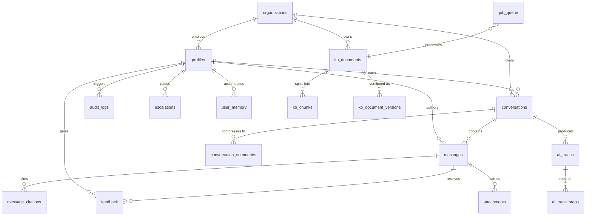

# Database

MASTER_BUILD_SPEC.md §11 (Database Architecture) and §23.4 (Phase 4). This
document is the ERD-plus-reference companion to the SQL itself, which lives
in `supabase/migrations/`.

## Status

Schema is **fully written** (18 tables, 13 enums, 40+ indexes, 4 search
functions) but **not yet applied or verified against a live database**. The
hackathon portability override (`docs/IMPLEMENTATION_OVERRIDE.md`) removes
Docker, and this environment has no cloud Supabase project configured
(`NEXT_PUBLIC_SUPABASE_URL` / `SUPABASE_SERVICE_ROLE_KEY` unset). Every
integration test in `src/__tests__/integration/db/` is written for real
against this schema and `describe.skipIf`s itself when those variables are
absent — the moment a project exists, run:

```bash
npm run db:reset   # drops public schema, reapplies all migrations, verifies RLS
npm run db:types   # regenerates src/types/database.types.ts from the live schema
npm test           # the skipped suites (rls, queries, jobs) now run for real
```

## Entity Relationship Diagram



> `message_citations` is defined by Phase 6/7 (citation rendering), not Phase
> 4 — the diagram above matches MASTER_BUILD_SPEC.md §11.2 verbatim and is
> not yet fully backed by a migration for that one table.

## Tables

| #   | Table                    | Migration | Purpose                              | RLS                                                                                   |
| --- | ------------------------ | --------- | ------------------------------------ | ------------------------------------------------------------------------------------- |
| 1   | `organizations`          | 003       | Tenancy root (single row, MVP)       | `org_read`                                                                            |
| 2   | `profiles`               | 004       | Users, roles, MFA flag               | `profile_read_own/staff`, `profile_update_own`, `profile_admin_all`                   |
| 3   | `conversations`          | 005       | Chat/widget threads                  | `conv_own` (private, even from admins)                                                |
| 4   | `messages`               | 005       | Turn-by-turn content                 | `msg_own` (inherits conversation ownership)                                           |
| 5   | `attachments`            | 005       | Uploaded files, ≤10MB                | `attach_own`                                                                          |
| 6   | `kb_documents`           | 006       | Uploaded/ingested source docs        | `kbdoc_read` (visibility×role), `kbdoc_admin`                                         |
| 7   | `kb_document_versions`   | 006       | Supersede history                    | `kbver_read`, `kbver_admin`                                                           |
| 8   | `kb_chunks`              | 006       | Embedded, searchable chunks          | `kbchunk_read` (the retrieval boundary), `kbchunk_admin`                              |
| 9   | `snow_incident_cache`    | 007       | 5-minute ServiceNow cache            | `snow_read_own` (by `caller_email`), `snow_read_staff`                                |
| 10  | `conversation_summaries` | 008       | Rolling memory compression           | `convsum_own`                                                                         |
| 11  | `user_memory`            | 008       | Cross-session durable facts          | `usermem_own`                                                                         |
| 12  | `ai_traces`              | 009       | One row per AI run                   | `trace_own`, `trace_admin`                                                            |
| 13  | `ai_trace_steps`         | 009       | One row per agent step               | `step_own`                                                                            |
| 14  | `feedback`               | 010       | Thumbs up/down, one per user/message | `fb_own`, `fb_read_mgr`                                                               |
| 15  | `escalations`            | 010       | Human hand-off records               | `esc_own`, `esc_insert_own`, `esc_staff`                                              |
| 16  | `audit_logs`             | 011       | Append-only privileged-action log    | `audit_read_admin`, `audit_insert` — **no UPDATE/DELETE policy exists, for any role** |
| 17  | `feature_flags`          | 011       | Runtime toggles                      | `flag_read`, `flag_admin`                                                             |
| 18  | `job_queue`              | 012       | Background job durability            | `job_admin` (service role bypasses for processing)                                    |

Every table carries `org_id` (assumption A-26, future multi-tenant split)
and has RLS **enabled**, with policies co-located in the migration that
creates the table rather than deferred to a single `014_rls.sql` — see the
Open Decisions Log entry for the rationale (no table is ever RLS-enabled
with zero policies for longer than the width of one migration file).

## Indexes of note

- `idx_chunks_embedding`, `idx_snow_embedding`, `idx_usermem_emb` — HNSW,
  `vector_cosine_ops`, `m=16, ef_construction=64` (§11.6).
- `idx_chunks_tsv` — GIN over a generated `tsvector` column, for sparse
  lexical search (FR-RAG-3).
- Every foreign key used in a `WHERE` clause has a matching index (DoD).

## Search functions (`013_functions.sql`)

| Function                  | Purpose                                                                                                                     |
| ------------------------- | --------------------------------------------------------------------------------------------------------------------------- |
| `match_kb_chunks`         | Dense-only vector search                                                                                                    |
| `hybrid_search_kb_chunks` | Dense + sparse fused with Reciprocal Rank Fusion (`k=60`), computed in Postgres so only the fused top-N crosses the network |
| `match_similar_incidents` | Historical similar-incident search, resolved/closed only                                                                    |
| `match_user_memory`       | Cross-session recall, `min_similarity` floor                                                                                |

## Job queue

`job_queue` + `src/lib/jobs/queue.ts` + `src/lib/jobs/worker.ts` implement
the pattern from §8.5: enqueue → `pg_cron` tick every 60s → claim → dispatch
→ complete/retry/dead-letter.

**Known gap:** the spec's `SELECT ... FOR UPDATE SKIP LOCKED` claim requires
a database function (PostgREST cannot express row locking). Until a live
Postgres exists to validate that function, `claimJobs()` uses an optimistic
per-row conditional `UPDATE ... WHERE status = <previous status>`, which is
still safe against double-processing (the second writer's `WHERE` no longer
matches once the first commits) but issues one round-trip per candidate
instead of one for the whole batch. Upgradeable to a real `claim_jobs()` RPC
without changing the `claimJobs()` call signature.

## Handlers registered (Phase 4)

None. `src/lib/jobs/worker.ts` dispatches by `job_type` to a handler map that
every later phase fills in its own entry for (`document.ingest` — Phase 5,
`incident.sync` — Phase 8, `memory.summarise` — Phase 6,
`analytics.rollup`/`retention.purge` — Phase 9). An unhandled job type is
marked `completed` immediately with a warning log, so it never retries
forever waiting for a handler that isn't scheduled to exist yet.

## `pg_cron` schedules (`015_cron.sql`)

| Job                 | Schedule        | Requires                                                              |
| ------------------- | --------------- | --------------------------------------------------------------------- |
| `process-job-queue` | every minute    | `pg_net` (for `net.http_post`), `app.base_url`/`app.cron_secret` GUCs |
| `sync-servicenow`   | every 5 minutes | —                                                                     |
| `rollup-analytics`  | hourly          | —                                                                     |
| `purge-retention`   | daily at 03:00  | conversations 180d, traces 90d, audit 400d (A-41)                     |

`pg_net` is enabled by default on Supabase-hosted projects; a self-hosted
Postgres instance must install it separately for `process-job-queue` to fire.
